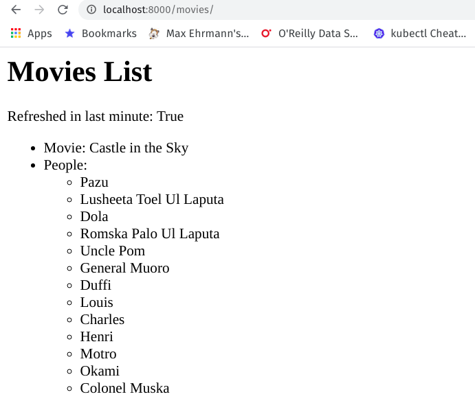
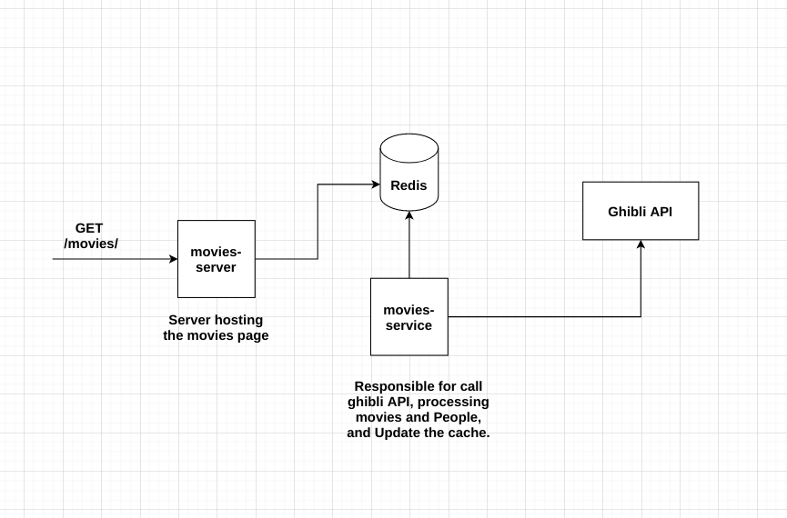

# Ghibli movies server
Studio Ghibli is a Japanese movie company. They offer a ​REST API ​where one can query
information about movies and people (characters). This application is basically a web server that serves one route `/movies/` to display all the movies and its people produced by Ghibli studio.
## Requirements:
- use ghibli studio public [API](https://ghibliapi.herokuapp.com/) to collect movies info.
- list all movies and it's people on a page.
- API call should not happen on every page load.
- Movies info should not be older than 1 minute.

# How to Build and Run:
- setup dev env:
```
   $ virtualenv -p python3 movies-list
   $ source movies-list/bin/activate
   $ pip3 install -r requirements.txt 
```
- run server from root directory of the repo `uvicorn app.server:APP --host 127.0.0.1`. You can visit `localhost:8000/movies/` to view the movies list.


**Note:** to provide different config, you can set the config variables listed in `example.env` in new `.env` file. Or you can set those variables as Env variables. Preference will always be given to Env variables, then to `.env` file.

# Build and run using Docker:
- exec `make build-docker` to build and `make run-docker` to run the app.
## Run tests:
- exec `make test`

# Repo structure:
```
- app/ contains core server code
   routes/ contains server routes
   services/ contains services required to process requests
   tests/ test cases
   config.py settings object definition
   server.py definition of the app server
- templates/ contains html templates
```

# Solution Overview:
- using the cache: cache is used to store pre-processed movies list, it keeps the response time minimum by keeping the movies list in memory.
- background_task: as the movie's webpage might be visited by users often, we wanted our users to view the movies list in minimum time possible, so what we have done is created a background task which runs before server start up and after every 50 seconds to call the ghibli APIs and update the cache with latest movies list. 
We could have achieved the same correctness with on-demand processing and API call, but we have prioritized user experience here. What if the background task fails or times out ? Users will still see the movies list but maybe older than 1 minute.
 
# Future Considerations
## Scalability and Performance:
This app has been designed considering scalability as a requirement. We can scale this in the following ways.
1. We can run multiple replicas of the same application in any container orchestration tool like docker-swarm or Kubernetes. And set-up a load balancer in front, to distribute the load between multiple application instances.
2. For maximum performance, we can refactor our app to use Redis as a cache layer and run background task as a different sefvice outside the scope of the current application. This approach will reduce the memory and processing footprint as cache and background_task will be running seperately instead of being maintained inside each application replica.
Redis also provides transaction support, with this we can make sure that our movie cache will always remain consistent.

## Testing:
- more test cases can be written, but that would require creating the mock server. For example, we can write a test case about what happens if request times out of ghibli server is not running. Or what will happen if it returns inconsistent data.

# Tools used:
- [FastAPI]() for web server.
- [jinja]() for templates.
- [uvicorn]() for hosting.